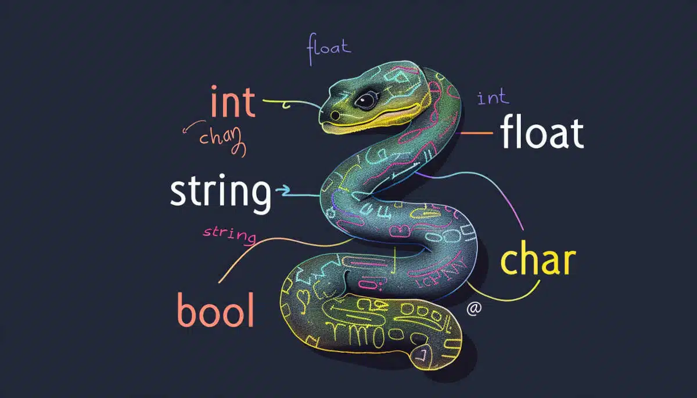
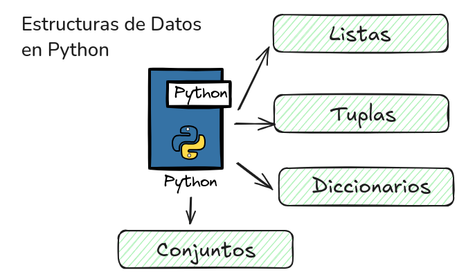
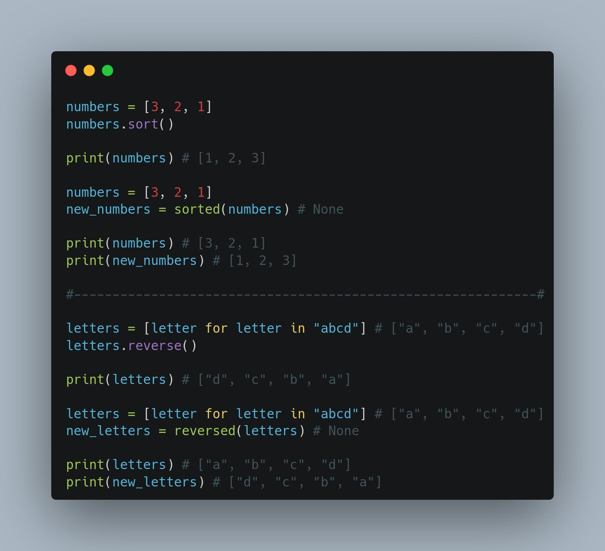

# dominando_las_listas_en_python

# DOMINANDO LAS LISTAS EN PYTHON

### EL PROBLEMA DE LAS VARIABLES 

° una variable simple es una caja de pequeña: solo puede guardar una casa a la vez

### la solucion: el sistema de inventario

°una estructura de datos te permite agrupar y organizar multiples elementos. en python, tu mejor herramientas es la lista

### anatomia de una lista en python 

° una lista de python es una estructura de datos ordenada y mutable que permite almacenar multiples elementos (incluso de distintos tipos) separados por comas dentro de corchetes [].su anatomia se caracteriza por ser endexada (empieza en 0), dinamica (se puede modificar) y permitir elementos duplicados 

### el secreto del indice cero 

para calcular un elemento, usas su indice (su numero de posicion). pero cuidado: !las computadoras empiezan a contar desde el cero!

### entrenando con el inventario 

°usa los corchetes [] junto al nombre de la lista para extraer un dato 

# MODIFICANDO DATOS (EL REEMPLAZO)

°puedes reescribir el contenido de cualquier ranura asignando  un nuevo valor directamente 

# trucos utiles del inventario

Gestionar inventarios en Python es eficiente usando diccionarios para búsquedas rápidas O (1), collections.Counter para conteo automático de items, y pandas para análisis de datos masivos. Trucos clave incluyen actualizar stock con métodos de diccionario, usar P00 para estructurar productos y try-except para validar entradas de usuario.

